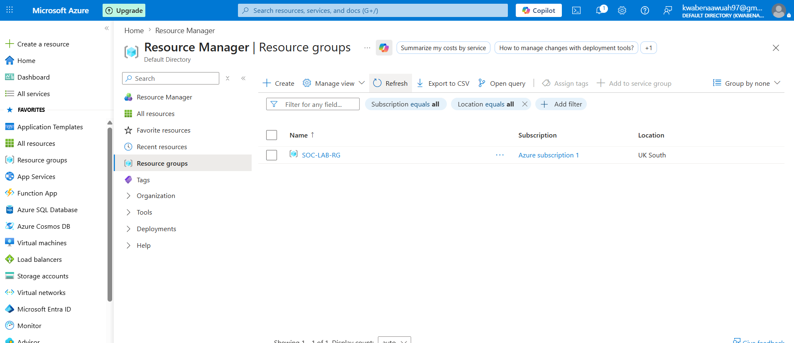
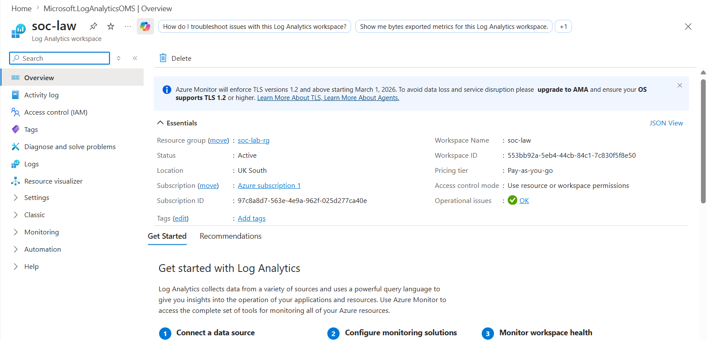
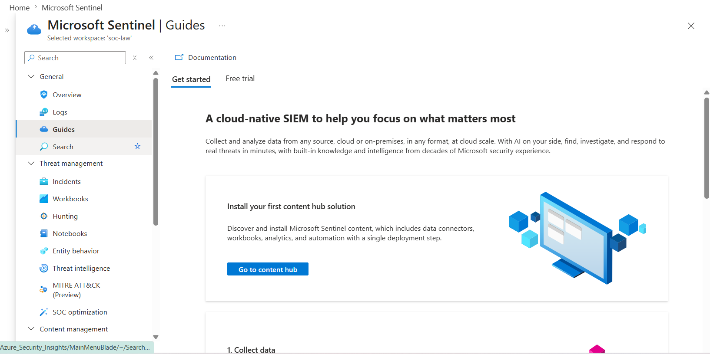
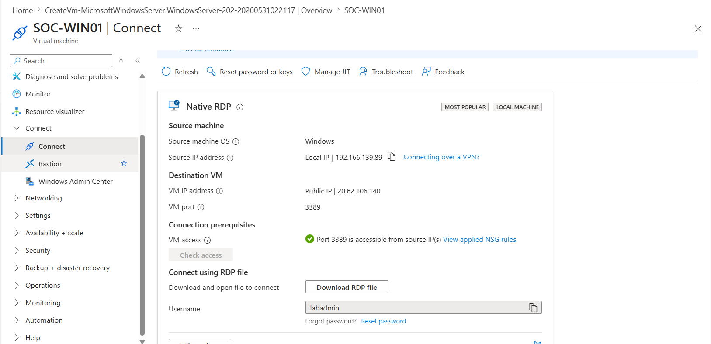
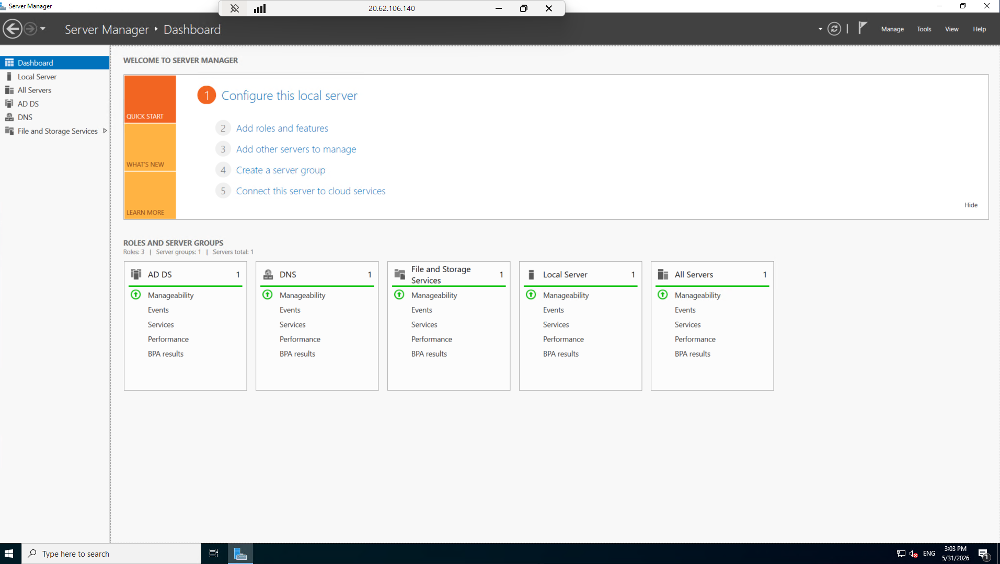
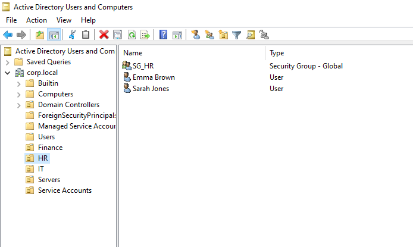
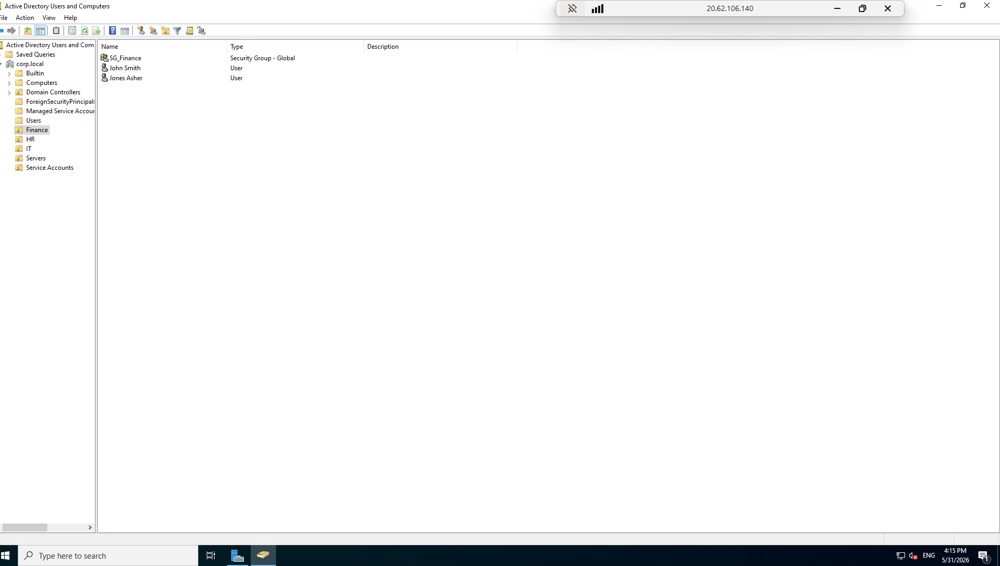
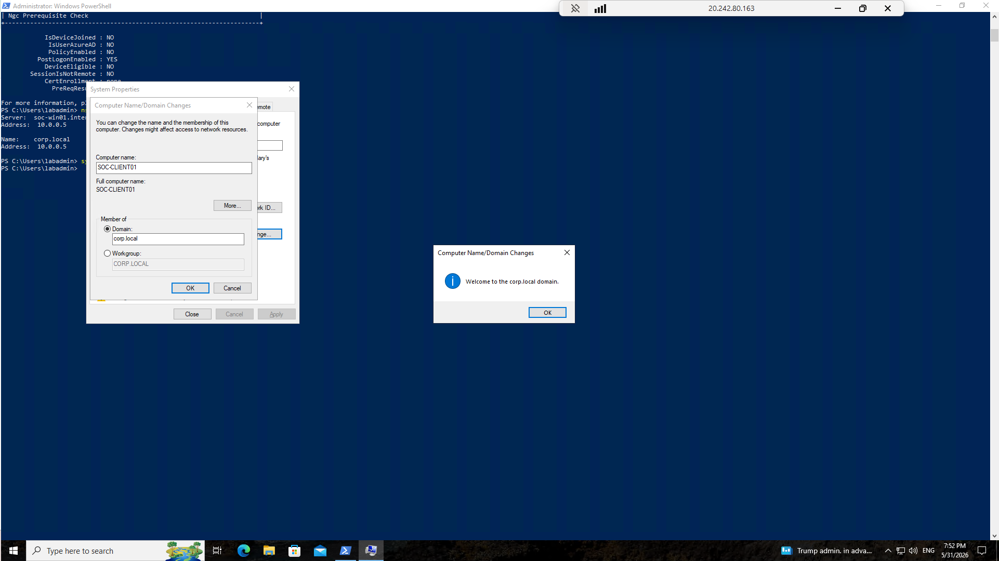
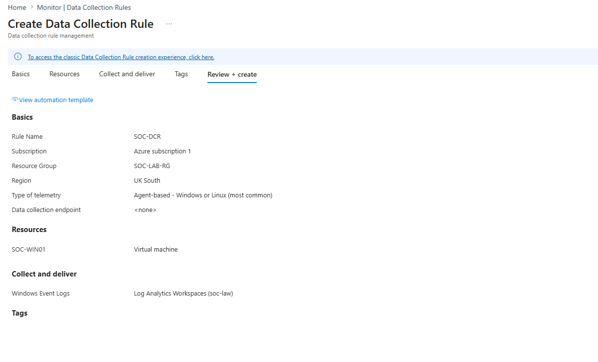
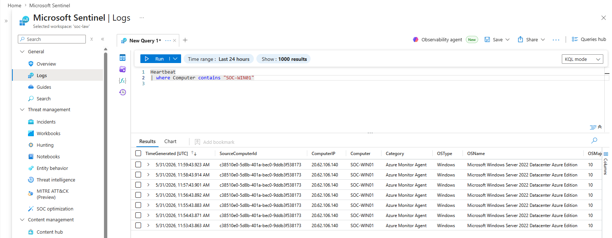

## Lab Build
Objective

Built a Microsoft Sentinel environment capable of collecting Windows Security Events and generating actionable alerts.

---

## 1. Resource Group

Created a dedicated Azure Resource Group to host all SOC lab resources.

---

## 2. Log Analytics Workspace

Configured a Log Analytics Workspace to centralise security telemetry from monitored systems.

----

## 3. Microsoft Sentinel

Enabled Microsoft Sentinel and connected it to the Log Analytics Workspace.

---

## 4. Domain Controller

Deployed a Windows Server 2022 virtual machine and configured it as a domain controller.

---

## 5. Active Directory

Installed Active Directory Domain Services and created the CORP.LOCAL domain.

---

## 6. Users and Groups

Created users and security groups to simulate a production environment and RBAC implementation

Examples:

john.smith, sarah.jones, peter.admin

Groups:

SG_Finance
SG_IT
SG_Server_Admins

---

## 7. Domain Workstation

Deployed and joined SOC-CLIENT01 to the domain.

---

## 8. Data Collection Rule

Created a Data Collection Rule to ingest Windows Security Events for both VMS

---

## 9. Validation

Verified successful log ingestion through Heartbeat events and Security Event logs.

-----

## Lessons Learned
  How Microsoft Sentinel ingests telemetry.
  The importance of Data Collection Rules.
  Active Directory event monitoring.
  Building role-based access controls.
  Validating telemetry before building detections.

